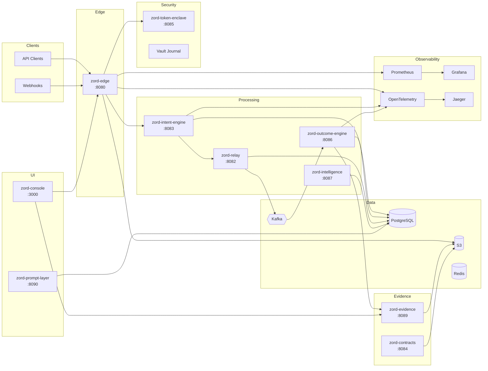
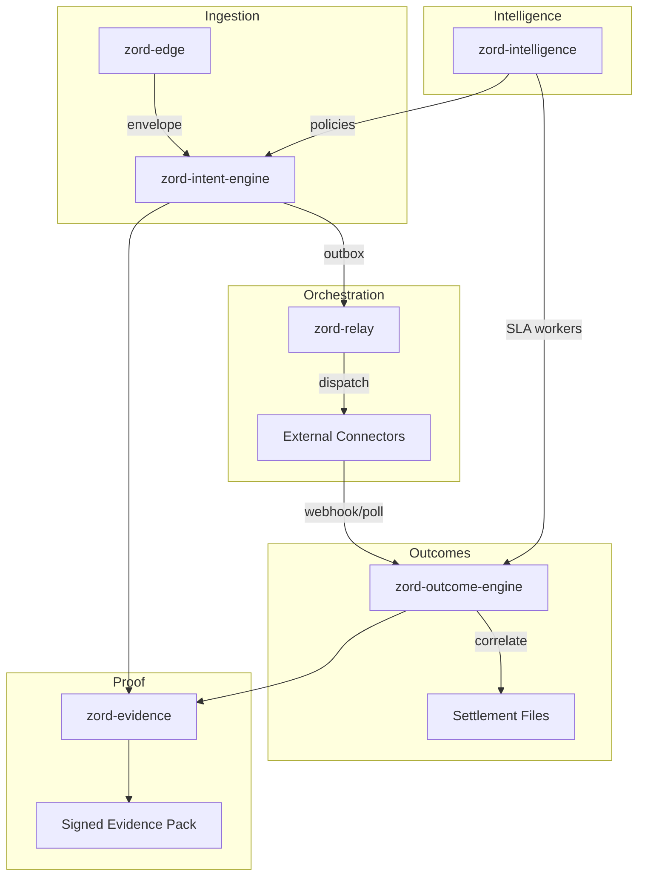
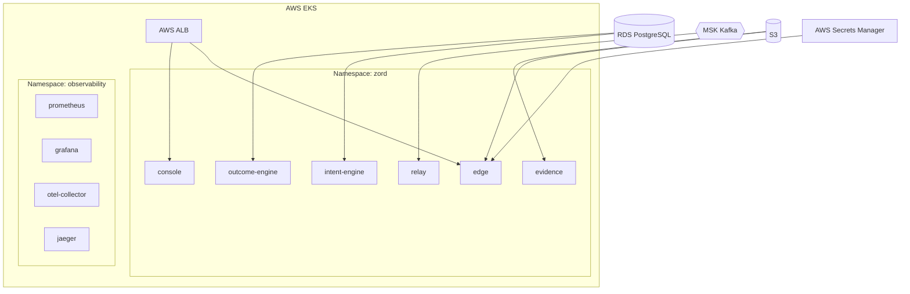
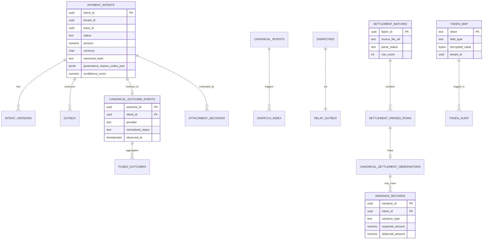
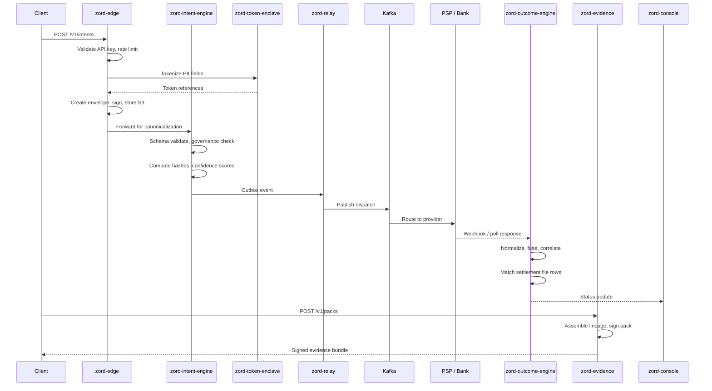
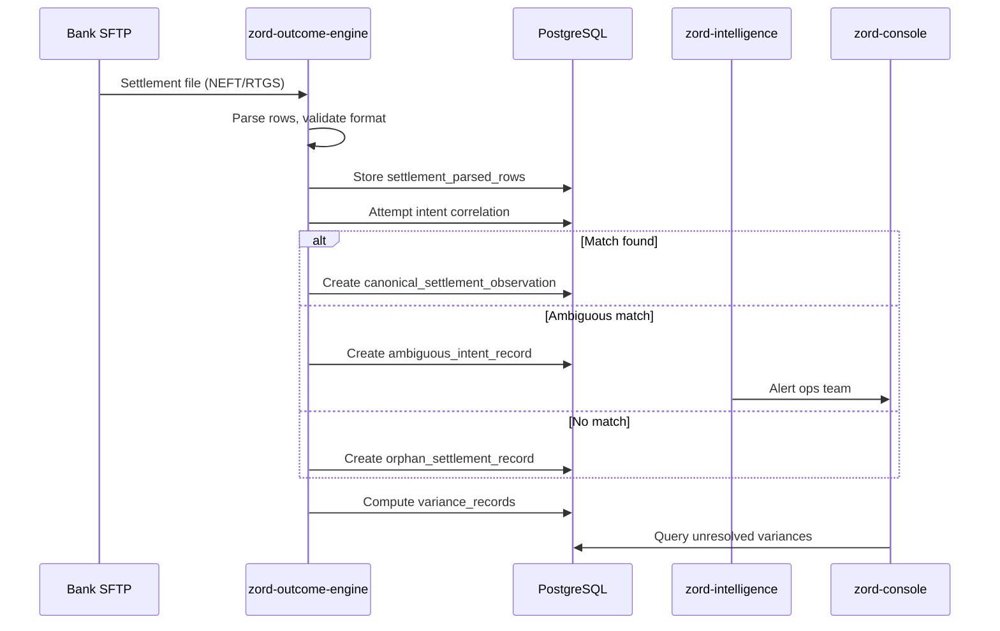
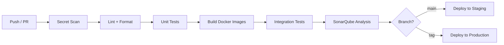

# Arealis Zord

**Verifiable payment lifecycle infrastructure for fragmented financial truth.**

> Businesses don't fail because payments break. They fail because no single system can prove what actually happened.

---


---

[](https://go.dev/)
[](https://www.typescriptlang.org/)
[](https://nextjs.org/)
[](https://www.docker.com/)
[](https://kafka.apache.org/)
[](https://kubernetes.io/)
[](LICENSE)
[](CONTRIBUTING.md)
[](https://github.com/swaroopt14/swaroopt14/releases)

---

## Table of Contents

- [Problem Statement](#problem-statement)
- [Why Existing Systems Fail](#why-existing-systems-fail)
- [Solution](#solution)
- [Key Features](#key-features)
- [System Architecture](#system-architecture)
- [Repository Structure](#repository-structure)
- [Tech Stack](#tech-stack)
- [Getting Started](#getting-started)
- [Configuration](#configuration)
- [API Documentation](#api-documentation)
- [Database Design](#database-design)
- [Workflow](#workflow)
- [Screenshots](#screenshots)
- [Performance](#performance)
- [Security](#security)
- [Deployment](#deployment)
- [CI/CD](#cicd)
- [Testing](#testing)
- [Monitoring](#monitoring)
- [Roadmap](#roadmap)
- [Contributing](#contributing)
- [License](#license)
- [Acknowledgements](#acknowledgements)
- [Contact](#contact)

---

## Problem Statement

A payment is not a single event. It is a lifecycle.

Authorization happens at the gateway. Settlement arrives days later from the bank. PSP dashboards show a third version. Finance teams reconcile CSV exports against internal ledgers. Disputes require screenshots from four systems.

Each actor holds a partial view of truth:

| Actor | What they know |
|---|---|
| Bank | Settlement files, NEFT/RTGS references |
| PSP | Transaction status, UPI refs, webhook payloads |
| Gateway | Authorization responses, redirect callbacks |
| Internal ledger | Journal entries, payout batches |
| Finance team | Spreadsheets, email threads, manual joins |

The result is **fragmented payment truth** — not failed payments, but unprovable ones.

Finance teams spend hours answering questions that should be machine-verifiable:

- Did this payout actually settle?
- Which intent maps to this bank reference?
- Why do two systems disagree on amount or status?
- What evidence exists if a dispute is filed six months later?

Zord exists to close that gap.

---

## Why Existing Systems Fail

| Dimension | Current Process | Zord |
|---|---|---|
| **Truth model** | Per-system snapshots, manually joined | Canonical lifecycle with cryptographic lineage |
| **Reconciliation** | Batch CSV comparison, reactive | Continuous correlation across intent → outcome → settlement |
| **Evidence** | Screenshots, exports, email threads | Signed evidence packs with inclusion proofs |
| **Ambiguity** | Discovered during month-end close | Detected at ingestion with explicit reason codes |
| **Audit trail** | Scattered across 4–6 tools | Append-only event journal with tenant isolation |
| **Explainability** | "Ask the PSP" | Traceable governance decisions and confidence scores |
| **Observability** | Per-service dashboards | End-to-end traces from edge to settlement |
| **Governance** | Policy docs + manual review | Enforced at intent canonicalization with state machine |

> The failure mode is not downtime. It is **unanswerable questions at reconciliation time**.

---

## Solution

Zord is a multi-service platform that wraps payment events in a **verifiable lifecycle**:

```
Ingest → Canonicalize → Dispatch → Observe → Correlate → Package Evidence
```

Each stage produces durable artifacts:

1. **Envelope** — raw intake with tenant context and idempotency key
2. **Canonical Intent** — schema-validated, governance-checked payment instruction
3. **Dispatch** — reliable relay to downstream connectors via transactional outbox
4. **Outcome** — normalized provider responses fused into a single state
5. **Settlement Observation** — bank file rows correlated to intents
6. **Evidence Pack** — signed, replayable proof bundle for audit and dispute

The platform is designed for operators who need to **prove** what happened — not just process transactions.

---

## Key Features

### Payment Lifecycle

End-to-end tracking from API ingestion through settlement confirmation. Every state transition is recorded, hashed, and traceable.

### Evidence Packaging

Generate cryptographically signed evidence packs with lineage graphs, inclusion proofs, and dispute-ready exports.

### Reconciliation Engine

Correlate intents, outcomes, and settlement observations. Surface variances, orphans, and ambiguous matches before they become month-end incidents.

### Ambiguity Detection

Explicit handling for unresolved, ambiguous, and conflicted intents. Reason codes instead of silent failures.

### Governance Layer

Policy enforcement at canonicalization — confidence scores, proof-readiness metrics, and governance state machines.

### Tokenization Boundary

PII and sensitive fields tokenized at the edge. Detokenization restricted to authorized enclave services.

### Observability

OpenTelemetry traces, Prometheus metrics, Grafana dashboards, and structured audit logs across all services.

### Multi-Tenant Console

Next.js operator UI for customers, ops teams, and admins — role-based views over intents, batches, and evidence.

---

## System Architecture

### High-Level Flow



### Service Responsibilities



### Deployment Topology



---

## Repository Structure

```
swaroopt14/
├── backend/
│   ├── zord-edge/              # Public ingestion edge, API-key auth, webhooks
│   ├── zord-intent-engine/     # Validation, canonicalization, idempotency
│   ├── zord-relay/             # Event relay, transactional outbox, Kafka
│   ├── zord-token-enclave/     # PII tokenization and detokenization
│   ├── zord-contracts/         # Contract generation, evidence packaging
│   ├── zord-outcome-engine/    # Outcome ingestion, settlement correlation
│   ├── zord-evidence/          # Evidence packs, lineage, dispute exports
│   ├── zord-intelligence/      # Policies, projections, SLA workers
│   ├── zord-prompt-layer/      # Retrieval and LLM-assisted queries
│   ├── zord-console/           # Next.js operator and admin UI
│   └── observability/          # Dashboards, collector config, test helpers
├── kubernetes/
│   ├── eks/                    # EKS deployments, HPA, PDB, secrets
│   ├── monitoring/             # Prometheus, Grafana, exporters
│   ├── tracing/                # Jaeger, OpenTelemetry collector
│   └── logging/                # Elasticsearch, Fluentd, Kibana
├── jenkins/                    # CI/CD pipeline assets
├── functional-tests/           # End-to-end test suites
├── performance-tests/          # Load and benchmark scripts
├── legal/                      # Compliance templates
├── assets/                     # README images and diagrams
├── docker-compose.yml          # Local multi-service stack
├── .github/workflows/          # GitHub Actions
└── README.md
```

---

## Tech Stack

| Layer | Technology |
|---|---|
| **Frontend** | Next.js 14, TypeScript, Tailwind CSS, React Server Components |
| **Backend** | Go 1.24, Gin, structured logging, OpenTelemetry SDK |
| **Database** | PostgreSQL 16, JSONB for flexible payloads |
| **Queue** | Apache Kafka (KRaft mode), transactional outbox pattern |
| **Cache** | Redis for idempotency, rate limiting, session state |
| **Object Storage** | AWS S3 for envelopes, snapshots, evidence artifacts |
| **Cloud** | AWS (EKS, RDS, MSK, ALB, Secrets Manager, S3) |
| **AI** | Retrieval-augmented query layer for operator workflows |
| **Deployment** | Docker, Docker Compose, Kubernetes, Argo CD |
| **Monitoring** | Prometheus, Grafana, Jaeger, OpenTelemetry Collector |
| **Authentication** | JWT (HS256), API keys, Kong gateway integration |
| **Secrets** | AWS Secrets Manager, External Secrets Operator |

---

## Getting Started

### Prerequisites

| Tool | Version |
|---|---|
| Docker Desktop / Engine | 24+ with Compose v2 |
| Go | 1.24.x |
| Node.js | 18+ |
| PostgreSQL | 16+ (if running services outside Docker) |
| Make | optional |

### Installation

```bash
git clone https://github.com/swaroopt14/swaroopt14.git
cd swaroopt14
```

### Environment Variables

Copy the example file and fill in values for your environment:

```bash
cp .env.example .env
```

See [Configuration](#configuration) for the full variable reference.

### Running Locally

#### Full stack with Docker Compose

```bash
docker compose up -d --build
```

Verify services:

```bash
docker compose ps
curl http://localhost:8080/health
curl http://localhost:3000/api/health
```

#### Single service (Go)

```bash
cd backend/zord-edge
go mod download
go run ./cmd/main.go
```

#### Console (Next.js)

```bash
cd backend/zord-console
npm install
npm run dev
```

Open `http://localhost:3000`.

### Production

For production deployments, use the Kubernetes manifests under `kubernetes/eks/` with external secrets and managed PostgreSQL/Kafka. See [Deployment](#deployment).

---

## Configuration

### `.env.example`

```bash
# ── Database ──────────────────────────────────────────────
DB_HOST=localhost
DB_PORT=5432
DB_USER=zord
DB_PASSWORD=changeme
DB_NAME=zord_edge
DB_SSLMODE=disable

# ── AWS / Object Storage ──────────────────────────────────
AWS_REGION=ap-south-1
S3_BUCKET=zord-envelopes-dev
OBJECT_STORE_VERSION=v1

# ── Authentication ────────────────────────────────────────
JWT_SIGNING_SECRET=your-256-bit-secret
JWT_ISSUER=zord-edge
JWT_AUDIENCE=zord-api
INTERNAL_ADMIN_KEY=admin-key-for-internal-routes
RELAY_AUTH_TOKEN=shared-relay-token

# ── Encryption / Signing ──────────────────────────────────
ZORD_VAULT_KEY=base64-encoded-32-byte-key
VAULT_KEY_ID=v1
SIGNING_KEY_PATH=ed25519_private.pem

# ── Kafka ─────────────────────────────────────────────────
KAFKA_BROKERS=localhost:9092
KAFKA_TOPIC_INTENTS=zord.intents
KAFKA_TOPIC_OUTCOMES=zord.outcomes

# ── Redis ─────────────────────────────────────────────────
REDIS_URL=redis://localhost:6379

# ── Observability ─────────────────────────────────────────
OTEL_EXPORTER_OTLP_ENDPOINT=http://localhost:4317
OTEL_EXPORTER_OTLP_INSECURE=true
OTEL_SERVICE_NAME=zord-edge

# ── Console ───────────────────────────────────────────────
NEXT_PUBLIC_API_URL=http://localhost:8080
NEXTAUTH_SECRET=changeme
NEXTAUTH_URL=http://localhost:3000

# ── Rate Limiting ─────────────────────────────────────────
RATE_LIMIT_RPS=100
RATE_LIMIT_BURST=200
```

<details>
<summary><strong>Variable reference</strong></summary>

| Variable | Required | Description |
|---|---|---|
| `DB_HOST` | Yes | PostgreSQL hostname |
| `DB_PORT` | Yes | PostgreSQL port (default `5432`) |
| `DB_USER` | Yes | Database username |
| `DB_PASSWORD` | Yes | Database password |
| `DB_NAME` | Yes | Database name per service |
| `DB_SSLMODE` | Yes | `disable` for local, `require` for production |
| `AWS_REGION` | Yes | AWS region for S3 and SDK clients |
| `S3_BUCKET` | Yes | Bucket for envelope and snapshot storage |
| `JWT_SIGNING_SECRET` | Yes | HS256 signing secret, min 32 bytes |
| `JWT_ISSUER` | No | Token issuer claim |
| `JWT_AUDIENCE` | No | Token audience claim |
| `ZORD_VAULT_KEY` | Yes | AES-256 encryption key for vault journal |
| `SIGNING_KEY_PATH` | No | Ed25519 private key path for envelope signing |
| `KAFKA_BROKERS` | Yes | Comma-separated broker list |
| `OTEL_EXPORTER_OTLP_ENDPOINT` | No | OpenTelemetry collector endpoint |
| `REDIS_URL` | No | Redis connection string for caching |
| `RATE_LIMIT_RPS` | No | Requests per second per tenant |

</details>

---

## API Documentation

### Service Endpoints

| Service | Port | Base Path | Health |
|---|---|---|---|
| zord-edge | 8080 | `/v1` | `GET /health` |
| zord-intent-engine | 8083 | `/v1` | `GET /health` |
| zord-relay | 8082 | `/v1` | `GET /health` |
| zord-outcome-engine | 8086 | `/v1` | `GET /health` |
| zord-evidence | 8089 | `/v1` | `GET /healthz` |
| zord-token-enclave | 8085 | `/v1` | `GET /health` |
| zord-console | 3000 | `/api` | `GET /api/health` |

### zord-edge — Ingestion

#### Submit Payment Intent

```http
POST /v1/intents
Authorization: Bearer <api_key>
X-Idempotency-Key: payout-2026-04-07-001
X-Tenant-ID: 3fa85f64-5717-4562-b3fc-2c963f66afa6
Content-Type: application/json
```

**Request**

```json
{
  "intent_type": "PAYOUT",
  "amount": 150000,
  "currency": "INR",
  "beneficiary": {
    "account_number": "****4521",
    "ifsc": "HDFC0001234",
    "name": "Acme Suppliers Pvt Ltd"
  },
  "client_payout_ref": "PO-2026-44102",
  "intended_execution_at": "2026-04-07T10:00:00Z"
}
```

**Response `202 Accepted`**

```json
{
  "envelope_id": "7c9e6679-7425-40de-944b-e07fc1f90ae7",
  "trace_id": "a1b2c3d4-e5f6-7890-abcd-ef1234567890",
  "status": "RECEIVED",
  "idempotency_key": "payout-2026-04-07-001",
  "created_at": "2026-04-07T09:14:22Z"
}
```

#### Webhook Intake

```http
POST /v1/webhooks/{provider}
X-Webhook-Signature: sha256=...
Content-Type: application/json
```

### zord-intent-engine — Canonicalization

#### Get Intent Status

```http
GET /v1/intents/{intent_id}
Authorization: Bearer <token>
```

**Response `200 OK`**

```json
{
  "intent_id": "3fa85f64-5717-4562-b3fc-2c963f66afa6",
  "status": "CANONICALIZED",
  "governance_state": "VALID",
  "amount": 150000,
  "currency": "INR",
  "confidence_score": 0.97,
  "proof_readiness_score": 0.91,
  "canonical_hash": "sha256:abc123...",
  "created_at": "2026-04-07T09:14:25Z"
}
```

### zord-evidence — Proof Bundles

#### Generate Evidence Pack

```http
POST /v1/packs
Authorization: Bearer <token>
Content-Type: application/json
```

**Request**

```json
{
  "tenant_id": "3fa85f64-5717-4562-b3fc-2c963f66afa6",
  "intent_id": "7c9e6679-7425-40de-944b-e07fc1f90ae7"
}
```

**Response `201 Created`**

```json
{
  "pack_id": "ep-2026-04-07-001",
  "intent_id": "7c9e6679-7425-40de-944b-e07fc1f90ae7",
  "signature": "ed25519:...",
  "artifact_ref": "s3://zord-evidence/ep-2026-04-07-001.json",
  "created_at": "2026-04-07T11:30:00Z"
}
```

#### Verify Evidence Pack

```http
POST /v1/packs/{packID}/verify
```

**Response `200 OK`**

```json
{
  "valid": true,
  "pack_id": "ep-2026-04-07-001",
  "verified_at": "2026-04-07T12:00:00Z",
  "checks": {
    "signature": "PASS",
    "lineage": "PASS",
    "inclusion_proofs": "PASS"
  }
}
```

### Error Responses

| Status | Code | Description |
|---|---|---|
| `400` | `INVALID_PAYLOAD` | Schema validation failed |
| `401` | `UNAUTHORIZED` | Missing or invalid credentials |
| `403` | `FORBIDDEN` | Tenant isolation violation |
| `409` | `IDEMPOTENCY_CONFLICT` | Duplicate key with different payload |
| `422` | `GOVERNANCE_REJECTED` | Policy engine rejected intent |
| `429` | `RATE_LIMITED` | Tenant rate limit exceeded |
| `500` | `INTERNAL_ERROR` | Unhandled server error |

**Error body**

```json
{
  "error": {
    "code": "GOVERNANCE_REJECTED",
    "message": "Intent failed proof-readiness threshold",
    "reason_codes": ["MISSING_BENEFICIARY_FINGERPRINT"],
    "trace_id": "a1b2c3d4-e5f6-7890-abcd-ef1234567890"
  }
}
```

---

## Database Design

### Entity Relationship Diagram



### Core Tables

| Table | Service | Purpose |
|---|---|---|
| `payment_intents` | intent-engine | Canonical payment instructions |
| `outbox` | intent-engine | Transactional outbox for relay |
| `dispatches` | relay | Dispatch records and delivery state |
| `relay_outbox` | relay | Kafka publish outbox |
| `canonical_outcome_events` | outcome-engine | Normalized provider outcomes |
| `fused_outcomes` | outcome-engine | Aggregated outcome state per intent |
| `settlement_batches` | outcome-engine | Bank file ingestion batches |
| `variance_records` | outcome-engine | Amount/status mismatches |
| `ambiguous_intent_records` | outcome-engine | Unresolved correlation cases |
| `token_map` | token-enclave | Tokenized PII storage |

### Indexes

Key indexes for query performance:

```sql
CREATE INDEX idx_intents_tenant_status ON payment_intents (tenant_id, status);
CREATE INDEX idx_intents_idempotency ON payment_intents (tenant_id, idempotency_key);
CREATE INDEX idx_outcomes_intent ON canonical_outcome_events (intent_id);
CREATE INDEX idx_settlement_batch ON settlement_parsed_rows (batch_id);
CREATE INDEX idx_variance_intent ON variance_records (intent_id);
CREATE INDEX idx_dispatches_status ON dispatches (status, created_at);
```

---

## Workflow

### Payment Intent Lifecycle



### Reconciliation Flow



---

## Screenshots

### Operator Dashboard


### Analytics & Reconciliation


### Evidence Timeline


### Mobile View


### Architecture Overview


### Settlement Correlation


> Place screenshots in `assets/`. Recommended resolution: 1440×900 for desktop, 390×844 for mobile.

---

## Performance

### Latency Targets

| Operation | P50 | P99 | Notes |
|---|---|---|---|
| Intent ingestion (edge) | 45ms | 180ms | Includes envelope creation and S3 write |
| Canonicalization | 80ms | 350ms | Schema + governance evaluation |
| Dispatch publish | 15ms | 60ms | Outbox → Kafka |
| Outcome normalization | 30ms | 120ms | Per webhook event |
| Evidence pack generation | 200ms | 800ms | Depends on lineage depth |

### Scalability

- **Horizontal scaling** — all Go services are stateless; scale via Kubernetes HPA
- **Kafka partitioning** — intents partitioned by `tenant_id` for ordering guarantees
- **Connection pooling** — pgx pool per service, tuned for RDS instance class
- **S3 offloading** — large payloads stored in object storage, not PostgreSQL

### Caching

- Redis-backed idempotency registry (TTL: 24h)
- API key lookup cache (TTL: 5m)
- Governance policy cache (TTL: 1m, invalidated on policy update)

### Optimization

- Batch settlement file parsing with streaming row processor
- Prepared statements for hot query paths
- Prometheus recording rules for pre-aggregated SLI metrics

---

## Security

### Authentication

| Method | Scope |
|---|---|
| API Key (`Bearer`) | Client ingestion, tenant-scoped |
| JWT (HS256) | Console sessions, inter-service where applicable |
| Internal Admin Key | Ops routes, outbox lease/ack |
| Relay Auth Token | Relay ↔ service internal communication |

### Encryption

- **At rest** — AES-256 for vault journal, S3 server-side encryption
- **In transit** — TLS 1.2+ on all external endpoints
- **PII** — format-preserving tokenization via `zord-token-enclave`
- **Signing** — Ed25519 envelope signatures, evidence pack signatures

### Secrets Management

- Development: `.env` files (never committed)
- Production: AWS Secrets Manager via External Secrets Operator
- Key rotation supported for `ZORD_VAULT_KEY` and JWT signing secrets

### Rate Limiting

Per-tenant token bucket at the edge gateway. Configurable via `RATE_LIMIT_RPS` and `RATE_LIMIT_BURST`.

### Audit Logs

- Append-only `token_audit` table for PII access
- Structured JSON logs with `trace_id`, `tenant_id`, `actor`
- All governance decisions recorded with reason codes

### Validation

- JSON Schema validation at ingestion
- SQL injection prevention via parameterized queries
- Tenant isolation enforced at middleware and query level

---

## Deployment

### Local

```bash
docker compose up -d --build
```

### Docker (single service)

```bash
cd backend/zord-edge
docker compose up -d --build
```

### AWS (EKS)

```bash
# Apply shared resources
kubectl apply -k kubernetes/eks/shared/

# Deploy services
kubectl apply -k kubernetes/eks/services/zord-edge/
kubectl apply -k kubernetes/eks/services/zord-intent-engine/
# ... repeat for each service

# Deploy observability stack
kubectl apply -k kubernetes/monitoring/
kubectl apply -k kubernetes/tracing/
```

### Railway / Render

Deploy individual services as Docker containers. Minimum viable stack:

1. `zord-edge` — public-facing
2. `zord-intent-engine` — processing
3. PostgreSQL — managed database
4. `zord-console` — UI

Set environment variables via platform dashboard. Use managed Redis and S3-compatible storage.

### Kubernetes (full stack)

The `kubernetes/eks/` directory contains production-ready manifests:

- Deployments with resource limits and probes
- Horizontal Pod Autoscalers (CPU/memory targets)
- Pod Disruption Budgets
- External Secrets for AWS Secrets Manager
- ALB Ingress for edge and console

---

## CI/CD

### GitHub Actions

| Workflow | Trigger | Purpose |
|---|---|---|
| `gitleaks.yml` | Push, PR | Secret scanning |
| `sonarqube.yml` | Push to main | Code quality analysis |

### Pipeline Stages



### Local Quality Checks

```bash
# Go linting
cd backend/zord-edge && golangci-lint run

# Pre-commit hooks
pre-commit run --all-files

# Console lint
cd backend/zord-console && npm run lint
```

---

## Testing

### Unit Tests

```bash
cd backend/zord-intent-engine
go test ./... -v -cover
```

### Integration Tests

```bash
cd functional-tests
go test ./... -tags=integration
```

### End-to-End

```bash
cd functional-tests
./run-e2e.sh
```

### Performance / Load

```bash
cd performance-tests
k6 run scenarios/intent-ingestion.js
```

### Coverage Targets

| Service | Target |
|---|---|
| zord-intent-engine | 80% |
| zord-outcome-engine | 75% |
| zord-evidence | 75% |
| zord-edge | 70% |

---

## Monitoring

### Logs

Structured JSON via stdout. Aggregated in production through Fluentd → Elasticsearch → Kibana.

```json
{
  "level": "info",
  "service": "zord-intent-engine",
  "trace_id": "a1b2c3d4-e5f6-7890-abcd-ef1234567890",
  "tenant_id": "3fa85f64-5717-4562-b3fc-2c963f66afa6",
  "intent_id": "7c9e6679-7425-40de-944b-e07fc1f90ae7",
  "msg": "intent canonicalized",
  "confidence_score": 0.97
}
```

### Metrics

Prometheus endpoints at `/metrics` on each Go service.

Key metrics:

| Metric | Type | Description |
|---|---|---|
| `http_requests_total` | Counter | Request count by method, endpoint, status |
| `http_request_duration_seconds` | Histogram | Request latency distribution |
| `intents_canonicalized_total` | Counter | Intents processed by status |
| `outbox_lag_seconds` | Gauge | Outbox processing delay |
| `settlement_variances_total` | Counter | Unresolved reconciliation variances |
| `evidence_packs_generated_total` | Counter | Evidence packs created |

### Tracing

OpenTelemetry instrumentation with OTLP export to Jaeger. Trace context propagated via `trace_id` from edge through all downstream services.

### Alerts

Prometheus alerting rules for:

- Outbox lag > 30s
- Error rate > 1% over 5m
- Settlement parse failures
- Ambiguous intent backlog > threshold
- Pod restart loops

Grafana dashboards provisioned under `kubernetes/monitoring/grafana/`.

---

## Roadmap

- [x] Multi-service ingestion edge with envelope signing
- [x] Intent canonicalization and governance engine
- [x] Transactional outbox relay via Kafka
- [x] Outcome normalization and fusion
- [x] Settlement file ingestion and correlation
- [x] Evidence pack generation with lineage graphs
- [x] PII tokenization enclave
- [x] Next.js operator console
- [x] Kubernetes deployment manifests (EKS)
- [x] OpenTelemetry + Prometheus observability stack
- [ ] Real-time variance alerting with configurable thresholds
- [ ] Multi-region active-active deployment
- [ ] GraphQL API for console data layer
- [ ] Automated dispute export workflows
- [ ] Connector SDK for third-party PSP integrations
- [ ] Policy engine UI for non-engineering operators
- [ ] SOC 2 Type II compliance documentation
- [ ] Performance benchmarks published (k6 scenarios)

---

## Contributing

We welcome contributions. This is a production-inspired project — PRs should reflect that standard.

### Process

1. Fork the repository
2. Create a feature branch: `git checkout -b feat/your-feature`
3. Make changes with tests where applicable
4. Run linting and tests locally
5. Open a PR with a clear description of the problem and solution

### Standards

- Go: `gofmt`, `golangci-lint`, table-driven tests
- TypeScript: ESLint + Prettier (console)
- Commits: conventional commits preferred (`feat:`, `fix:`, `docs:`, `chore:`)
- No secrets in code — gitleaks runs on every PR

### Code of Conduct

Be direct, be respectful, be technical. See [CODE_OF_CONDUCT.md](CODE_OF_CONDUCT.md).

---

## License

MIT License — see [LICENSE](LICENSE).

```
Copyright (c) 2026 Swaroop Thakare

Permission is hereby granted, free of charge, to any person obtaining a copy
of this software and associated documentation files (the "Software"), to deal
in the Software without restriction, including without limitation the rights
to use, copy, modify, merge, publish, distribute, sublicense, and/or sell
copies of the Software, and to permit persons to whom the Software is
furnished to do so, subject to the following conditions:

The above copyright notice and this permission notice shall be included in all
copies or substantial portions of the Software.
```

---

## Acknowledgements

Built on ideas from payment infrastructure research, reconciliation system design, and modern distributed systems patterns:

- Transactional outbox for reliable event delivery
- Event sourcing principles for audit-grade lineage
- Format-preserving encryption for regulated data boundaries
- OpenTelemetry for vendor-neutral observability

Inspired by production work at [Arealis](https://arealis.network) on payment lifecycle infrastructure.

Special thanks to the open-source ecosystems behind Go, Kafka, PostgreSQL, Next.js, and Kubernetes — the foundations this platform runs on.

---

## Contact

| | |
|---|---|
| **GitHub** | [@swaroopt14](https://github.com/swaroopt14) |
| **LinkedIn** | [Swaroop Thakare](https://www.linkedin.com/in/swaroop-thakare-136484259/) |
| **Email** | swaroop.thakare@example.com |

---

<p align="center">
  <sub>Built by <a href="https://www.linkedin.com/in/swaroop-thakare-136484259/">Swaroop Thakare</a> · AI Engineer @ Arealis</sub>
</p>
