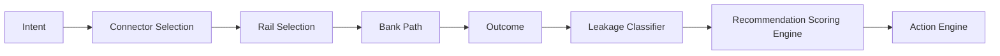

# Routing & Network Intelligence — Wireframe

**Routes:** `/payout-command-view/today?dock=connectors` and `/payout-command-view/connector-intelligence`

---

## Section order (top → bottom)

```
┌ Routing Intelligence Overview (KPI bar: 6 tiles) ───────────────────────┐
├ Network Health Trend (line) │ Leakage Composition (donut) ──────────────┤
├ Recommended Routes (Top 3 ranked by scoring engine) ─────────────────────┤
├ Connector Grid (filters + time selector + decision table) ───────────────┤
├ Correlation Insights (pattern bullets) ───────────────────────────────────┤
├ Preventable Leakage Impact (current vs preventable chart) ────────────────┤
├ Action Engine (prioritized recommendations with impact lines) ────────────┤
└ Connector drill-down drawer (row click, right side) ──────────────────────┘
```

---

## Chart intent

- **Network Health Trend:** success % vs latency index over selected window.
- **Leakage Composition:** unmatched, short-settled, unlinked, reversal share.
- **Preventable Leakage Impact:** current leakage exposure vs preventable leakage by action.
- **Drill-down trend:** selected connector success trend for last 7 days.

---

## Recommendation scoring (locked)

```text
score =
  (0.45 * success_rate)
  + (0.20 * latency_score)
  + (0.20 * stability_score)
  - (0.15 * failure_trend_penalty)
```

Normalization:
- Each score term is clamped/normalized to `0..100` before weighting.
- Rank is descending by final score.

Confidence:
- **High:** strong sample size, stable trend, no missing signals.
- **Medium:** moderate sample size or minor missing signals.
- **Low:** sparse sample and/or missing telemetry; render warning badge.

---

## Stale data + fallback behavior

- Show stale banner when snapshot age exceeds threshold.
- Keep rendering sections with latest snapshot, but flag stale state.
- For low-confidence recommendations, keep card visible and mark confidence warning instead of hiding rank.

---

## Routing lineage (Mermaid artifact)


