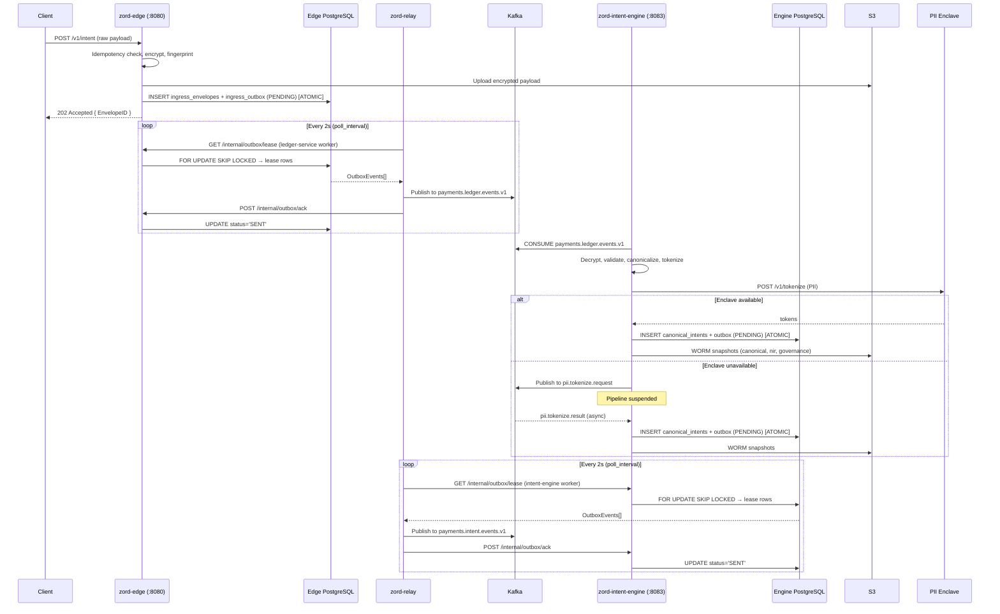

# Zord Services: Existing Flow Analysis

---

## Overview: Three-Service Architecture

```
[Client] → [zord-edge] → (ingress_outbox DB) ← polls ← [zord-relay] → Kafka → [zord-intent-engine]
                                                                                        ↓
                                                                               (outbox DB) ← polls ← [zord-relay]
                                                                                        ↓
                                                                                    Kafka (payments.intent.events.v1)
```

**zord-relay** is the central hub: it polls **two** upstream services' outboxes and forwards everything to Kafka.

---

## Service 1: `zord-edge` (Port 8080)

### Role
The **public-facing ingress gateway**. Receives raw payment intents from external clients, validates idempotency, encrypts the payload, stores it in S3, and writes atomically to PostgreSQL (`ingress_envelopes` + `ingress_outbox`).

### Boot Sequence
1. Initializes DB, creates tables
2. Loads config (vault key, signing key, S3 bucket/region)
3. Starts Gin HTTP server on `:8080`
4. Exposes `/internal/outbox/lease`, `/internal/outbox/ack`, `/internal/outbox/nack` for `zord-relay` to poll

### Core Request Flow: `POST /v1/intent`

```
Client Request
    ↓
[Middleware] — extracts tenant_id, idempotency_key, raw_payload, source_type
    ↓
[IntentHandler]
    1. Compute fingerprint = SHA256(payload + idempotencyKey + tenantID)
    2. PersistIdempotency() → check/insert idempotency_keys table
       - If fingerprint conflict → 400 IDEMPOTENCY_CONFLICT
       - If same key seen before → 409 DUPLICATE
    3. Build RawIntentMessage (metadata, headers hash, etc.)
    4. vault.Encrypt(rawPayload) → AES256 encrypted payload
    5. ProcessRawIntent() → upload encrypted payload to S3 → returns StorageAck (EnvelopeId, ObjectRef)
    6. Compute PayloadHash = SHA256(rawPayload)
    7. services.RawIntent() → SaveRawIntent() (ATOMIC DB TRANSACTION):
       a. INSERT into ingress_envelopes (full metadata + S3 ObjectRef)
       b. UPDATE idempotency_keys SET status='COMPLETED'
       c. INSERT into ingress_outbox (status='PENDING', topic='payments.ledger.events.v1')
    8. Return 202 { EnvelopeID, TraceID, Status: "Accepted" }
```

### Outbox Table (`ingress_outbox`)
- Written **atomically** with the envelope insert
- `status = 'PENDING'`
- `topic = 'payments.ledger.events.v1'`
- Contains: encrypted_payload, payload_hash, envelope_hash, envelope_signature
- Lease mechanism: `lease_id`, `lease_until`, `attempts`, `next_retry_at`

### Outbox Pull Endpoints (called by `zord-relay`)
| Endpoint | What it does |
|---|---|
| `GET /internal/outbox/lease?limit=N&lease_ttl_seconds=T` | Atomically grabs N PENDING rows using `FOR UPDATE SKIP LOCKED`, sets lease_id + lease_until |
| `POST /internal/outbox/ack` | Marks events as `SENT`, clears lease fields |
| `POST /internal/outbox/nack` | Increments `attempts`, exponential backoff on `next_retry_at`, marks `FAILED` after 7 attempts |

---

## Service 2: `zord-relay` (Port 9090 for metrics)

### Role
A **poll-based outbox relay**. Periodically leases events from upstream services' outbox HTTP endpoints and publishes them to Kafka. Fully stateless — no DB of its own.

### Boot Sequence
1. Load `config.yaml`
2. Create `KafkaPublisher` (Sarama-based, acks=all, snappy compression)
3. Create one `Worker` per configured service (currently 2: `intent-engine` + `ledger-service`)
4. Run each worker in a goroutine via `Scheduler`
5. Expose `/metrics` (Prometheus) and `/health` on `:9090`

### `config.yaml` — Configured Services
```yaml
services:
  - name: intent-engine
    base_url: http://zord-intent-engine-service:8083
    default_topic: payments.intent.events.v1

  - name: ledger-service
    base_url: http://zord-edge-service:8080
    default_topic: payments.ledger.events.v1
```

> `zord-relay` polls **both** `zord-intent-engine` (port 8083) and `zord-edge` (port 8080).

### Worker Poll Loop (`worker.go`)

```
for {
    acquire semaphore (backpressure gate — max 10 concurrent publishes)
    runCycle():
        1. outboxClient.Lease(limit=500, ttl=120s)
           → GET {base_url}/internal/outbox/lease
        2. If empty → release sema, sleep poll_interval (2s)
        3. For each event:
             proc.process(ctx, event):
               a. validateEvent() — checks event_id, tenant_id, event_type, payload
               b. publisher.Publish(ctx, event, topic) with retry (exponential backoff)
               c. If Kafka poison (too large, bad format) → PublishDLQ() poison topic
               d. If retries exhausted → PublishDLQ() publish-failure topic
        4. Batch Ack (success + poison events) → POST /internal/outbox/ack
        5. Batch Nack (transient failures) → POST /internal/outbox/nack
    release semaphore
}
```

### OutboxClient (`client/outbox_client.go`)
- Sets `X-Relay-Token` and `X-Relay-Instance-ID` headers on every request
- Has `HealthCheck()` for startup connectivity validation
- Uses OpenTelemetry tracing spans

### DLQ Strategy
| Case | DLQ Topic |
|---|---|
| Missing required fields (event_id, tenant_id, etc.) | `relay.dlq.poison` |
| Kafka message too large | `relay.dlq.poison` |
| Kafka publish failed after max retries | `relay.dlq.publish_failure` |

---

## Service 3: `zord-intent-engine` (Port 8083)

### Role
The **domain brain**. Consumes raw envelope events from Kafka, canonicalizes them, applies business logic (validation, dedup, scoring, PII tokenization), and persists a structured `CanonicalIntent` + writes to its own `outbox` (for `zord-relay` to pick up and publish to `payments.intent.events.v1`).

### Boot Sequence
1. Init DB, create tables
2. Init vault key, S3 store
3. Create Kafka producer (for outbound tokenize requests)
4. Create repos: `DLQRepo`, `PaymentIntentRepo`, `IntentQueryRepo`, `OutboxPullRepo`
5. Create `IntentService`
6. Start HTTP server on `:8083` (exposes `/internal/outbox/lease|ack|nack` for `zord-relay`)
7. Start worker pool (N goroutines consuming from `jobChan`)
8. Start Kafka consumer on topic `$KAFKA_TOPIC` (primary intent events)
9. Start Kafka consumer on topic `pii.tokenize.result` (async tokenization results)

### Two Kafka Consumer Topics

| Topic | Group ID | Handler |
|---|---|---|
| `$KAFKA_TOPIC` (e.g., `payments.ledger.events.v1`) | `intent-engine-group` | `ProcessIncomingIntent` |
| `pii.tokenize.result` | `intent-engine-tokenize-result-group` | `ProcessTokenizeResult` |

---

### Primary Pipeline: `ProcessIncomingIntent`

```
Kafka message (models.Event)
    ↓
[Worker pool] → intentService.ProcessIncomingIntent(ctx, event)

STEP 0: Transport guards
  - If Source == "WEBHOOK" → route to processWebhook() (separate path)
  - Check: non-empty payload, non-nil TraceID/EnvelopeID/TenantID, non-empty ObjectRef

STEP 1: Decrypt payload
  - vault.DecryptPayload(event.EncryptedPayload)
  - Recompute SHA256 of decrypted bytes, compare with event.PayloadHash (integrity check)

STEP 2: Parse JSON
  - json.Unmarshal → models.ParsedIncomingIntent

STEP 3: Build NIR (Normalized Ingest Record)
  - Extracts fields: intent_type, amount, currency, beneficiary_name, idempotency_key, client_batch_ref
  - Computes confidence scores, gap counts

STEP 4: Idempotency guard (DB)
  - repo.FindByEnvelope(tenantID, envelopeID) — if already processed, return cached result

STEP 5: Validation
  - validator.ValidateParsed() — business rule validation → may return DLQEntry

STEP 6: Canonicalization
  - canonicalizer.CanonicalizeIntent(intent) → CanonicalizedInput struct

STEP 7: Pre-Guards
  - guards.RunPreGuards(in, canonicalInput) → structural/business guards

STEP 8: PII Tokenization
  - callEnclaveTokenize() → POST to ZORD_PII_ENCLAVE_URL/v1/tokenize
  - If enclave UNAVAILABLE:
      → Publish TokenizeRequestEvent to Kafka (topic: pii.tokenize.request)
      → Return nil, nil, nil (pipeline suspended, async path takes over)
  - If enclave SUCCESS:
      → Compute beneficiary fingerprint (SHA256 of account/ifsc/vpa tokens)
      → Compute business idempotency key (SHA256 of tenant+fingerprint+amount+currency+day)

STEP 9: Build CanonicalIntent
  - Scores: mapping_confidence, proof_readiness, matchability, intent_quality, schema_completeness
  - Business idempotency registry check (dedup detection)
  - Build full models.CanonicalIntent struct

STEP 10: Atomic DB Persistence
  - CanonicalIntentToOutboxEvent() → builds models.OutboxEvent (status=PENDING)
  - repo.Save(ctx, nir, canonical, outbox, registryEntry)
    → In one DB transaction:
        INSERT canonical_intents
        INSERT normalized_ingest_records
        INSERT outbox (status='PENDING', topic='payments.intent.events.v1')
        INSERT business_idempotency_registry (optional)

STEP 11: WORM Snapshot (S3)
  - s3.StoreSnapshot("canonical", ...) → S3 key for canonical intent
  - s3.StoreSnapshot("nir", ...) → S3 key for NIR
  - s3.StoreSnapshot("governance", ...) → S3 key for governance state

STEP 12: Update DB with S3 refs
  - repo.UpdateSnapshotRefs(intentID, canonicalRef, nirRef, govRef, hash, prevHash)

Return: &CanonicalIntent (success)
```

---

### Async Tokenization Path: `ProcessTokenizeResult`

When the PII enclave was unavailable, a `TokenizeRequestEvent` was published to Kafka. When the enclave later processes it and publishes a result to `pii.tokenize.result`:

```
pii.tokenize.result Kafka message
    ↓
intentService.ProcessTokenizeResult(ctx, event)
    - Reconstruct NIR from event.Canonical
    - Re-derive beneficiary fingerprint, business idempotency key
    - Build full CanonicalIntent (same as sync path)
    - CanonicalIntentToOutboxEvent()
    - repo.Save() → atomic DB insert
    - S3 WORM snapshots
    - repo.UpdateSnapshotRefs()
Return: &CanonicalIntent
```

---

## End-to-End Data Flow Summary



---

## Key Architectural Patterns

| Pattern | Where |
|---|---|
| **Transactional Outbox** | Both `zord-edge` (ingress_outbox) and `zord-intent-engine` (outbox) write the outbox row atomically with the main record in the same DB transaction |
| **Pull-based Relay** | `zord-relay` polls upstream services at a configurable interval (2s default). No push/webhook from services to relay. |
| **Lease + Ack/Nack** | Outbox rows are leased with a TTL (120s). If `zord-relay` crashes mid-publish, the lease expires and the row becomes available again. Exponential backoff after nacks. |
| **Poison DLQ** | Structurally invalid or oversized Kafka messages go to `relay.dlq.poison` immediately — not retried |
| **Backpressure Semaphore** | `zord-relay` limits in-flight Kafka publishes to 10 (configurable) using a weighted semaphore |
| **WORM Snapshots** | `zord-intent-engine` writes immutable snapshots of each intent to S3 with chained hashes (prev_hash) for auditability |
| **Async PII Tokenization** | If the PII enclave is unavailable, the pipeline publishes a request to Kafka and suspends. The result consumer resumes the pipeline on the async result. |
| **Idempotency at two levels** | Edge-level: transport idempotency key; Engine-level: business idempotency key (SHA256 of beneficiary+amount+currency+day) |
